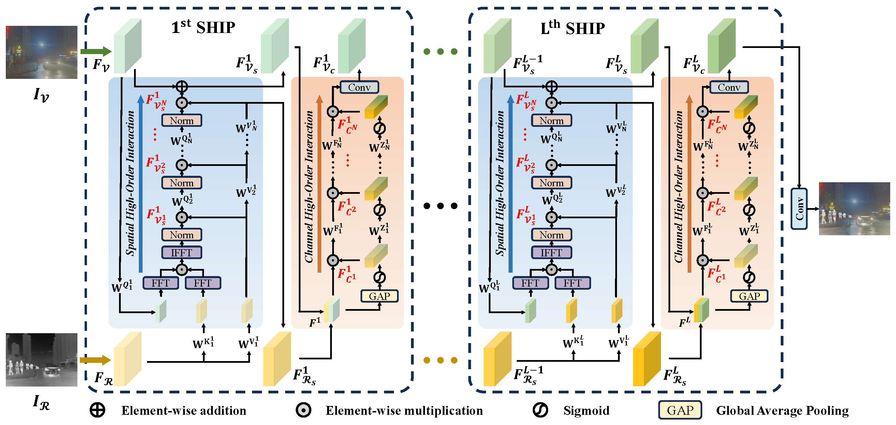
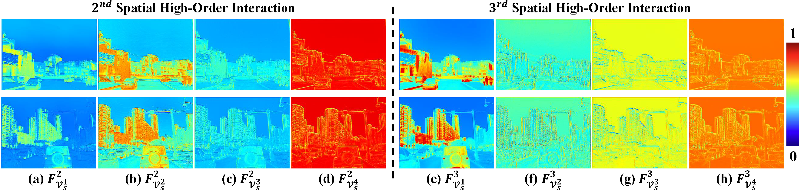

# Frequency Integration and Spatial Compensation Network for Infrared and Visible Image Fusion

Naishan Zheng, Man Zhou, Jie Huang, Junming Hou, Haoying Li, Yuan Xu, Feng Zhao

 University of Science and Technology of China, Southeast University, Zhejiang University

---
>Infrared and visible image fusion aims to generate a fused image by integrating and distinguishing complementary information from multiple sources. While the cross-attention mechanism with global spatial interactions appears promising, it only capture second-order spatial interactions, neglecting higher-order interactions in both spatial and channel dimensions. This limitation hampers the exploitation of synergies between multi-modalities. To bridge this gap, we introduce a Synergistic High-order Interaction Paradigm (SHIP), designed to systematically investigate the spatial fine-grained and global statistics collaborations between infrared and visible images across two fundamental dimensions: 1) Spatial dimension: we construct spatial fine-grained interactions through element-wise multiplication, mathematically equivalent to global interactions, and then foster high-order formats by iteratively aggregating and evolving complementary information, enhancing both efficiency and flexibility; 2) Channel dimension: expanding on channel interactions with first-order statistics (mean), we devise high-order channel interactions to facilitate the discernment of inter-dependencies between source images based on global statistics. Harnessing high-order interactions significantly enhances our model's ability to exploit multi-modal synergies, leading to superior performance over state-of-the-art alternatives, as shown through comprehensive experiments across various benchmarks. 
---




## 🚀: How to test

1. Update the paths of image sets and pre-trained models.
 ```
Updating the paths in configure files of /SHIP/options/test/highOrderInteractionFusion.yml
```

2. Run the testing commands.
 ```
python test.py -opt /SHIP/options/test/highOrderInteractionFusion.yml
```

## 🚀: How to train

1. Download saliency maps on the M3FD dataset from [Google Drive](https://drive.google.com/drive/folders/1CIsMmt6XZH4UMjca4K1DhLew_xNGrXv0?usp=drive_link) or run VSM.m to generate maps for your own data.

2. Update the paths of image sets in the training configuration.
 ```
Updating the paths in configure files of /SHIP/options/train/highOrderInteractionFusion.yml
```

3. Run the training commands.
 ```
python train.py -opt /SHIP/options/train/highOrderInteractionFusion.yml
```
